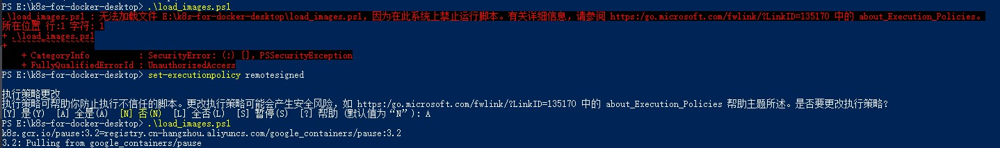
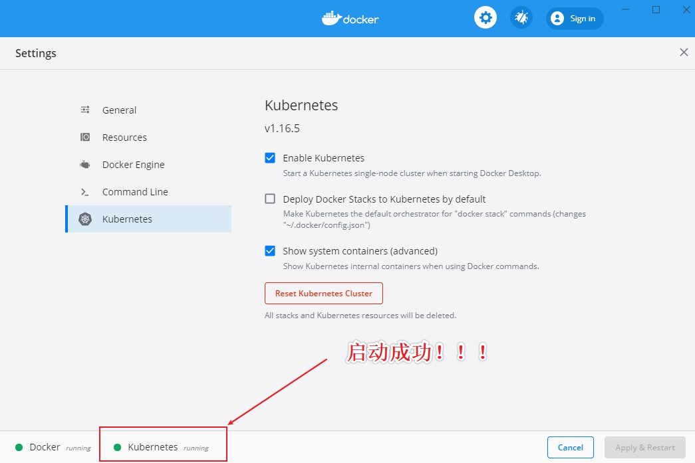
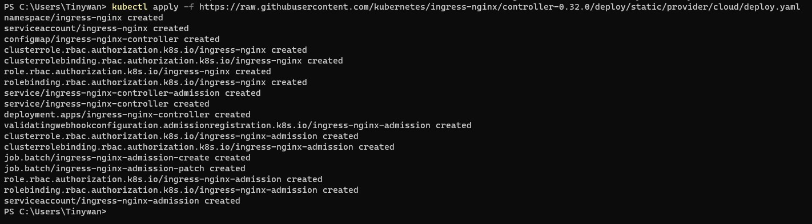
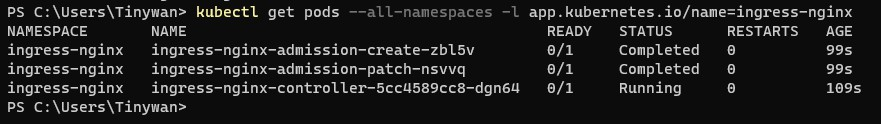

# Windows 10 & K8S

## 安装

安装教程

https://github.com/AliyunContainerService/k8s-for-docker-desktop/tree/v1.16.5

下载镜像
```
git clone https://github.com/AliyunContainerService/k8s-for-docker-desktop.git
```

切换分支
> 必须和本地安装 Docker Desktop的 Kubernetes 版本一致


```java
$ git checkout -b v1.16.5 origin/v1.16.5
Switched to a new branch 'v1.16.5'
Branch 'v1.16.5' set up to track remote branch 'v1.16.5' from 'origin'.

Tinywan@DESKTOP-IDODHG2 MINGW64 /e/K8S/k8s-for-docker-desktop (v1.16.5)
$ git branch
  master
  remotes/origin/v1.16.5
* v1.16.5
```

## 下载 Kubernetes 所需要镜像

在 Windows上，使用 PowerShell
```bash
> .\load_images.ps1
k8s.gcr.io/pause:3.1=registry.cn-hangzhou.aliyuncs.com/google_containers/pause:3.1
3.1: Pulling from google_containers/pause
cf9202429979: Pull complete                                                                                             Digest: sha256:759c3f0f6493093a9043cc813092290af69029699ade0e3dbe024e968fcb7cca
Status: Downloaded newer image for registry.cn-hangzhou.aliyuncs.com/google_containers/pause:3.1
registry.cn-hangzhou.aliyuncs.com/google_containers/pause:3.1
```

:x: 错误解决

```bash
.\load_images.ps1 : 无法加载文件 D:\k8s-for-docker-desktop\load_images.ps1，因为在此系统上禁止运行脚本。有关详细信息，请参阅 https:/go.microsoft.com/fwlink/?LinkID=135170 中的 about_Execution_Policies。
```

上面报错的原因是系统禁止运行脚本，通过一下命令并输入Y开启此功能：
```
set-executionpolicy remotesigned
```


查看已经下载好的镜像


## 开启 Kubernetes

等待 Kubernetes 开始运行

> 这里可能比较慢，差不多10分钟左右吧


开启成功后，是运行中的


## 配置 Kubernetes

开始配置
```php
> kubectl config use-context docker-desktop
```

验证 Kubernetes 集群状态
```java
> kubectl cluster-info
```


获取 Kubernetes 集群节点
```java
> kubectl get nodes
```


## 部署 Kubernetes 控制台

部署 Kubernetes dashboard
```php
> kubectl apply -f https://raw.githubusercontent.com/kubernetes/dashboard/v2.0.0-rc5/aio/deploy/recommended.yaml
```

或者
```php
> kubectl create -f kubernetes-dashboard.yaml
```


检查 kubernetes-dashboard 应用状态
```php
> kubectl get pod -n kubernetes-dashboard
```


开启 API Server 访问代理
```java
> kubectl proxy
```

## 配置控制台

对于Windows环境
```java
$TOKEN=((kubectl -n kube-system describe secret default | Select-String "token:") -split " +")[1]
kubectl config set-credentials docker-for-desktop --token="${TOKEN}"
echo $TOKEN
```


通过如下 URL 访问 Kubernetes dashboard
[http://localhost:8001/api/v1/namespaces/kubernetes-dashboard/services/https:kubernetes-dashboard:/proxy/](http://localhost:8001/api/v1/namespaces/kubernetes-dashboard/services/https:kubernetes-dashboard:/proxy/)

选择 Token 令牌，输入上文控制台输出的内容


或者选择 Kubeconfig 文件,路径如下：
```java
Mac: $HOME/.kube/config
Win: %UserProfile%\.kube\config
```
点击登陆，进入Kubernetes Dashboard，如图所示，标识安装成功了


## 配置 Ingress

安装 Ingress
```java
> kubectl apply -f https://raw.githubusercontent.com/kubernetes/ingress-nginx/controller-0.32.0/deploy/static/provider/cloud/deploy.yaml
```

:x: 错误提示
```java
Unable to connect to the server: dial tcp: lookup raw.githubusercontent.com: getaddrinfow: The requested name is valid, but no data of the requested type was found.
```
* 打开目录：`C:/Windows/System32/drivers/etc/`
* 找到`hosts`文件，使用管理员模式打开记事本
* 将`hosts`文件拖到管理员模式下的记事本中，然后在文件尾部添加以下文本：

```java
# GitHub Start
52.74.223.119 github.com
192.30.253.119 gist.github.com
54.169.195.247 api.github.com
185.199.111.153 assets-cdn.github.com
151.101.76.133 raw.githubusercontent.com
151.101.108.133 user-images.githubusercontent.com
151.101.76.133 gist.githubusercontent.com
151.101.76.133 cloud.githubusercontent.com
151.101.76.133 camo.githubusercontent.com
151.101.76.133 avatars0.githubusercontent.com
151.101.76.133 avatars1.githubusercontent.com
151.101.76.133 avatars2.githubusercontent.com
151.101.76.133 avatars3.githubusercontent.com
151.101.76.133 avatars4.githubusercontent.com
151.101.76.133 avatars5.githubusercontent.com
151.101.76.133 avatars6.githubusercontent.com
151.101.76.133 avatars7.githubusercontent.com
151.101.76.133 avatars8.githubusercontent.com
# GitHub End
```

重新执行安装命令



验证
```php
> kubectl get pods --all-namespaces -l app.kubernetes.io/name=ingress-nginx
```


## 测试示例应用

部署测试应用，详情参见[社区文章](https://matthewpalmer.net/kubernetes-app-developer/articles/kubernetes-ingress-guide-nginx-example.html)

进入案例目录：`E:\K8S\k8s-for-docker-desktop\sample>`


```php
kubectl create -f sample/apple.yaml
kubectl create -f sample/banana.yaml
kubectl create -f sample/ingress.yaml
```


测试示例应用
```php
$ curl -kL http://localhost/apple
apple

$ curl -kL http://localhost/banana
banana
```

删除示例应用
```php
kubectl delete -f sample/apple.yaml
kubectl delete -f sample/banana.yaml
kubectl delete -f sample/ingress.yaml
```
